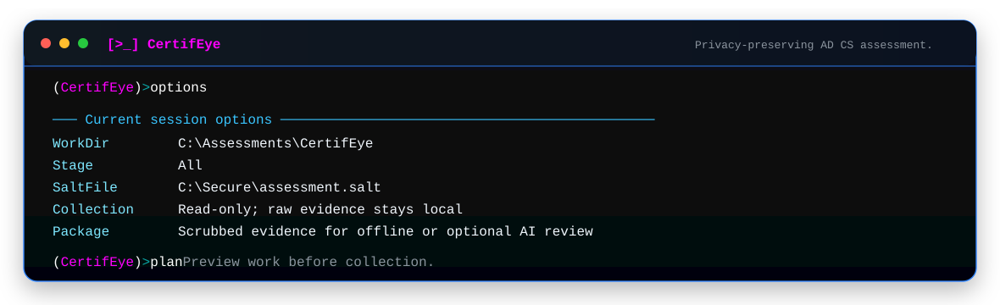

# CertifEye — AD CS Security Assessment

One interactive PowerShell driver that collects everything the **AD CS ESC Audit**
needs, scrubs it, and hands you upload-safe CSVs. It consolidates the whole pipeline —
issued-certificate export, template inventory, CA / PKI / DC / web-enrollment posture,
identity token-mapping, and leak-hardening — into a single prompt-driven tool.

<p align="center">
  
</p>

> **This collector produces UNSCRUBBED files first, then scrubs them.** Only the
> `*_scrubbed.csv` files and `high_value_targets_scrubbed.csv` are safe to share.
> The token map (`adcs_token_map_DO_NOT_UPLOAD.csv`) is secret — never upload it.

---

## What it collects

| # | Stage | Needs | Output (unscrubbed → scrubbed) |
|---|-------|-------|--------------------------------|
| 1 | Export issued/revoked certificates (SAN/EKU, identity mapping, SID extension) | CA database access | `exported_certs_normalized_*` |
| 2 | Trim the issued-cert export to the last N years | — | (same file, trimmed) |
| 3 | Certificate-template inventory + ESC1/ESC4 flags | AD / LDAP | `adcs_template_inventory_*` |
| 3b | CA security + PKI-object ACLs + DC enforcement + web enrollment | CA + AD/LDAP | `adcs_ca_security_*`, `adcs_pki_object_acls_*`, `adcs_dc_enforcement_*`, `adcs_web_enrollment_*` |
| 4 | Identity token map + high-value-target file | AD / LDAP | `adcs_token_map_DO_NOT_UPLOAD.csv`, `high_value_targets_scrubbed.csv` |
| 5 | Scrub a CSV with the token map (+ leak hardening) | — | `*_scrubbed.csv` |
| 6 | Leak-harden an already-scrubbed CSV | — | `*_scrubbed.csv` |
| 7 | **All** — run the whole pipeline end to end | all of the above | every file above |

Stage 3b covers **ESC5** (PKI object control), **ESC7** (Manage CA / Certificates),
**ESC6** (EDITF_ATTRIBUTESUBJECTALTNAME2), **ESC11** (InterfaceFlags encryption),
**ESC8** (web-enrollment metadata + optional active probe), and **KB5014754** per-DC
strong-certificate-binding enforcement (gates ESC9/ESC10).

---

## Requirements

- **Windows PowerShell 5.1+** (or PowerShell 7) on a host that can reach the CA and AD.
- Run it **on / near the issuing CA** with an account that has:
  - **CA access** (to export the issued-certificate database and read CA config).
  - **AD/LDAP read** (templates, PKI objects, DCs, enrollment-service metadata).
- For confirmed **DC strong-mapping reads**: RPC/DCOM (TCP 135 + dynamic) or WinRM to the DCs.
  If your CA logon is not a Domain Admin, supply an alternate credential when prompted (see below).
- For confirmed **ESC8 EPA reads**: local admin on the web-enrollment host (the CA host admin
  qualifies for its own certsrv).

Paths, salt sources, the year window, and the CA config can be supplied explicitly or selected interactively.

---

## How to run

The canonical entry point is `Invoke-ADCSAuditPipeline.ps1`. It contains both
the proven interactive collector and the explicit-path analysis mode. There is
no second text source; if email filtering is a concern, share a zip containing
this single script.

**Interactive (recommended):** no-argument execution opens the shared command console. Run `doctor`, `plan`, `collect`, `analyze`, and `validate` in order.
```powershell
.\Invoke-ADCSAuditPipeline.ps1
```
Pick a stage from the menu, or choose **All**. You'll be prompted for the working folder,
the HMAC salt (entered securely), and per-stage options.

**Legacy single stage (retains the original prompts):**
```powershell
.\Invoke-ADCSAuditPipeline.ps1 -WorkDir C:\Temp\ADCS-Audit -Stage All
```
`-Stage` accepts: `Export`, `Trim`, `Templates`, `CASecurity`, `TokenMap`, `Scrub`,
`Harden`, `Analyze`, or `All`. Collection stages remain interactive by design.

For an existing scrubbed package, run the reusable report pipeline without prompts:

```powershell
.\Invoke-ADCSAuditPipeline.ps1 `
  -Action Analyze `
  -NonInteractive `
  -InputDir C:\Temp\ADCS-Audit\Scrubbed `
  -OutputDir C:\Temp\ADCS-Audit\Output `
  -WorkingDir C:\Temp\ADCS-Audit\Working
```

For repeatable token correlation, prefer `-SaltFile` or `-SaltFromEnv`; do not place a salt directly in shell history. `-Action Validate -WorkDir ... -SafeBundlePath ...` creates a ZIP only from manifest-listed files.

### Local-only offline analysis (explicit opt-in)

For an environment that will **only** use CertifEye's local static reports and
will never share a package with an AI or external reviewer, explicitly add
`-NoTokenization`. This mode creates **no salt, token map, scrubbed package, or
safe upload manifest**. The raw exports stay in `Raw_DO_NOT_UPLOAD/` and reports
default to `Private_DO_NOT_UPLOAD/Output/`.

```powershell
# Collect locally. This remains interactive because CA and AD collection is interactive.
.\Invoke-ADCSAuditPipeline.ps1 -WorkDir C:\Assessments\CertifEye-Local -Stage All -NoTokenization

# Create local-only static reports. No data is safe to upload in this mode.
.\Invoke-ADCSAuditPipeline.ps1 -WorkDir C:\Assessments\CertifEye-Local `
  -Stage Analyze -NoTokenization -NonInteractive
```

`-NoTokenization` is intentionally a command-line-only switch: it cannot be
enabled from the interactive console. `validate` will report that the run is
local-only, and `-SafeBundlePath` is rejected. Use normal tokenized collection
for any package that might be uploaded, emailed, or evaluated by an AI tool.

The analyzer also accepts the same explicit paths directly:

```text
python .\skills\adcs-esc-audit\scripts\00_run_all.py --input-dir C:\Temp\ADCS-Audit\Scrubbed --output-dir C:\Temp\ADCS-Audit\Output --working-dir C:\Temp\ADCS-Audit\Working
```

See `docs/schema-contract.md` for the versioned input/output contract and the
`references/` directory for reusable detection, confidence, report, remediation,
and safety guidance.

New operators should start with the complete
[novice user guide](docs/Novice-User-Guide.md). For a presentation-safe offline
demonstration, generate all three large fictional scenarios with:

```powershell
.\tools\Invoke-CertifEyeSyntheticDemo.ps1 `
  -Scenario All `
  -Destination C:\Temp\CertifEye-Demo
```

The synthetic packages live under `synthetic-samples/` and span three years.
They cover an all-ESC environment, a fully evaluated hardened baseline, and a
mixed enterprise environment. No token map exists because no original identity
exists.

### Credential prompts (and when they appear)

| Prompt | When | What to enter |
|--------|------|---------------|
| **"Use an alternate credential for the DC reads"** | During Stage 3b, right after the CA-config line (before the web-probe questions) | A **Domain Admin** (or any account that can read the DCs' registry) — used over WinRM/DCOM. Needed only if your CA logon can't read the DCs. |
| **"Test account to authenticate to web enrollment"** | Only if you enable the active probe **and** the experimental behavioral EPA test | A **low-priv** account that can reach certsrv. Usually **not needed** — with host admin the EPA value is read deterministically from IIS. |

These are two **different** credentials for two different jobs. Answer **No** to the EPA
behavioral test if you have admin on the CA host.

---

## Output files

The single script creates this package layout:

```text
Raw_DO_NOT_UPLOAD/       local raw collector exports
Scrubbed/                reviewed scrubbed CSVs
Private_DO_NOT_UPLOAD/   token map, salts, and local-only evidence
Output/                  PDF, HTML, graph, findings, and export artifacts
Working/                 results.json and QA intermediates
adcs_upload_manifest.json
```

With explicit `-NoTokenization`, `Scrubbed/`, `Output/`, and
`adcs_upload_manifest.json` are intentionally not populated as a shareable
package. Use `Raw_DO_NOT_UPLOAD/` and `Private_DO_NOT_UPLOAD/Output/` locally
only.

Unscrubbed (local only) → scrubbed (upload-safe):

- `exported_certs_normalized_scrubbed.csv`
- `adcs_template_inventory_scrubbed.csv`
- `adcs_ca_security_scrubbed.csv`
- `adcs_pki_object_acls_scrubbed.csv`
- `adcs_dc_enforcement_scrubbed.csv`
- `adcs_web_enrollment_scrubbed.csv`
- `high_value_targets_scrubbed.csv`
- `adcs_token_map_DO_NOT_UPLOAD.csv` ← **secret, never upload**

Hand only reviewed files from `Scrubbed/` plus the safe upload manifest to the
AD CS skill. The `Output/` reports are local evidence unless separately reviewed.

---

## Security & correlation

- The **token map is secret.** It is the only thing that can reverse the anonymized tokens.
- **Upload only** the `*_scrubbed.csv` files and `high_value_targets_scrubbed.csv`.
- **Keep the salt secret and reuse the SAME salt** for every run that must correlate —
  otherwise tokens won't line up across files or across runs.
- Safe broad labels (`BROAD_AUTHENTICATED_USERS`, `BROAD_EVERYONE`) and default privileged
  group labels (`HV_GROUP_DOMAIN_ADMINS`, …) are intentionally preserved for risk scoring.

---

## accuracy improvements

This build hardens the low-confidence stages and adds resolution columns:

- **ESC5 extended-right resolution.** The PKI-object ACL export records the ACE's
  control-access-right GUID and resolves it, so an `ExtendedRight` is named precisely —
  new columns: `ObjectTypeGuid`, `ResolvedRight` (`Enroll` / `AutoEnroll` /
  `All-ExtendedRights` / `ExtendedRight:<guid>`), `RightCategory`, `IsEnrollRight`.
  Enroll/AutoEnroll are recorded as enrolment amplifiers, not mis-flagged as ESC5 control.
- **CA-own-host recognition.** Each `EnrollmentServiceCA` object is mapped to its host's
  computer-account SID; that account on its **own** CA object is recognized
  (`IsCAHostAccount`) and excluded from `ESC5Candidate` — scoped by SID to that object.
- **SID-based default-principal tests.** ESC4/ESC5/ESC7 "expected admin" checks are now
  SID-based (well-known SIDs + domain RIDs), with the English-name list only as a fallback —
  so renamed / non-English privileged groups aren't mis-flagged.
- **DC strong-mapping feedback + transports.** Read order is
  RemoteRegistry → WinRM → WMI/DCOM → SYSVOL/GPP. The WMI/CIM read is forced onto **DCOM
  (RPC)** (not WinRM), so it works even when WinRM is firewalled. Per-method failures are
  surfaced (new `ReadDetail` column) and a stage summary reports live-vs-fallback counts.
  An optional alternate credential is tried first over WinRM/DCOM.
- **ESC8 EPA.** EPA is now read for **every reachable HTTPS endpoint** (not only when NTLM
  was detected), `WWW-Authenticate` is parsed on non-401 responses, failures are surfaced,
  and a new `EpaDetail` column records what was read.

---

## Troubleshooting

- **DC values all say `SYSVOL/GPP` (intended, not live).** Your account can't read the DC
  registry. Re-run and supply the alternate DC credential; ensure RPC/DCOM (135 + dynamic)
  or WinRM is reachable. As a last resort, run on a DC:
  `(Get-ItemProperty 'HKLM:\SYSTEM\CurrentControlSet\Services\Kdc' StrongCertificateBindingEnforcement).StrongCertificateBindingEnforcement`
- **Both WinRM and WMI fail with the same WinRM error.** WinRM is blocked on the DCs. v2's
  WMI path uses **DCOM**, which is independent of WinRM — make sure you're on the v2 build
  and that RPC is reachable.
- **EPA = Unknown on a reachable HTTPS endpoint.** The IIS EPA read needs local admin on
  the web host. Run from the CA host (admin) or check `EpaDetail` for the exact error.
- **Lint before production.** Validate with your own change-control process / a
  `-WhatIf`/syntax pass before running in a production tier-0 environment.

---

*Companion to the AD CS ESC Audit skill. This collector is read-only data collection +
scrubbing — it does not issue certificates or perform any offensive action.*
